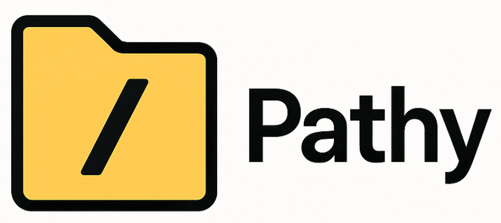

<h1 align="center">
  <br>
  
  <br>
</h1>

<h4 align="center">Fluently building and using file and directory paths without binary dependencies</h4>

<div align="center">

[](https://github.com/dennisdoomen/Pathy/actions?query=branch%3amain)
[](https://coveralls.io/github/dennisdoomen/pathy?branch=main)
[](https://github.com/dennisdoomen/pathy/releases/latest)
[](https://www.nuget.org/packages/pathy)
[](https://libraries.io/nuget/Pathy)

[](https://github.com/dennisdoomen/Pathy/graphs/contributors)
[](https://github.com/dennisdoomen/Pathy)
[](https://github.com/dennisdoomen/Pathy/graphs/commit-activity)
[](https://github.com/dennisdoomen/Pathy/issues)
[](https://makeapullrequest.com)


<a href="#about">About</a> •
<a href="#how-to-use-it">How To Use</a> •
<a href="#download">Download</a> •
<a href="#contributors">Contributors</a> •
<a href="#versioning">Versioning</a> •
<a href="#credits">Credits</a> •
<a href="#related">Related</a> •
<a href="#license">License</a>

</div>

## About

### What's this?

Pathy is a tiny source-only library that will allow you to build file and directory paths by chaining together strings like `"c:"`, `"dir1"`, `"dir2"` using

```csharp
ChainablePath.New() / "c:" / "dir1" / "dir2";
```

Note how the `/` operator is used to chain multiple parts of a path together. This is the primary feature of Pathy. And it doesn't matter if you do that on Linux or Windows. Internally it'll use whatever path separator is suitable.

You can also use the `+` operator to add some phrase to the path _without_ using a separator.

```csharp
var path = ChainablePath.From("c:") / "my-path" / "to" / "a" / "directory";

path = path + "2"

// Returns "c:/my-path/to/a/directory2"
string result = path.ToString();
```

It was heavily inspired by the best build pipeline framework available in the .NET space, [Nuke](https://nuke.build/). Nuke has supported these concepts for many years, but I needed this capability outside build pipelines. Lots of kudos to [Matthias Koch](https://www.linkedin.com/in/matthias-koch-jb/) for what I see as a brilliant idea.

### What's so special about that?

It makes those chained calls to `Path.Combine` a thing from the past and hides the ugliness of dealing with (trailing) slashes.

It ships as a source-only package, which means you can use it in your own libraries and projects, without incurring any dependency pain on your consuming projects. It runs on .NET 4.7, .NET 8, as well as frameworks supporting .NET Standard 2.0 and 2.1.

The core Pathy package does not have any dependencies, and I purposely moved the [globbing](https://learn.microsoft.com/en-us/dotnet/core/extensions/file-globbing#pattern-formats) functionality into a separate package as it depends on `Microsoft.Extensions.FileSystemGlobbing`.

### Who created this?
My name is Dennis Doomen and I'm a Microsoft MVP and Principal Consultant at [Aviva Solutions](https://avivasolutions.nl/) with 28 years of experience under my belt. As a software architect and/or lead developer, I specialize in designing full-stack enterprise solutions based on .NET as well as providing coaching on all aspects of designing, building, deploying and maintaining software systems. I'm the author of several open-source projects such as [Fluent Assertions](https://www.fluentassertions.com), [Reflectify](https://github.com/dennisdoomen/reflectify), [Liquid Projections](https://www.liquidprojections.net), and I've been maintaining [coding guidelines for C#](https://www.csharpcodingguidelines.com) since 2001.

Contact me through [Email](mailto:dennis.doomen@avivasolutions.nl), [Bluesky](https://bsky.app/profile/dennisdoomen.com), [Twitter/X](https://twitter.com/ddoomen) or [Mastadon](https://mastodon.social/@ddoomen)

## Download

This library is available as [a NuGet package](https://www.nuget.org/packages/Pathy) on https://nuget.org. To install it, use the following command-line:

  `dotnet add package Pathy`

## How do I use it?

### To ChainablePath and back to string
It all starts with the construction of a `ChainablePath` instance to represent a path to a file or directory.

There are several ways of doing that.

```csharp
// Various ways for constructing a ChainablePath 
var path = ChainablePath.From("c:") / "my-path" / "to" / "a" /"directory");
var path = ChainablePath.New() / "c:" / "my-path" / "to" / "a" / "directory";
var path = "c:/mypath/to/a/directory".ToPath();
var path = (ChainablePath)"c:/mypath/to/a/directory";

// Find the first available file in the order of appearance and return a
// ChainablePath representing that file
var path = ChainablePath.FindFirst("build.yml", ".github\\build.yml");
```

Additionally, you can use `ChainablePath.Current` to get the current working directory as an instance of `ChainablePath`, and `ChainablePath.Temp` to get that for the user's temporary folder.

To convert an instance of `ChainablePath` back to a `string`, you can either call `ToString()` or cast the instance to a `string`.

```csharp
string rawPath = path.ToString();
string rawPath = (string)path;
```

### Working with paths

Know that `ChainablePath` overrides `Equals` and `GetHashCode`, so you can always compare two instances as you're used to.

Given an instance of `ChainablePath`, you can get a lot of useful information:
* `Name` returns the full name, but without the directory, whereas `Extension` gives you the extension _including_ the dot.
* `Directory`, `Parent` or `DirectoryName` give you the (parent) directory of a file or directory.
* To see if a path is absolute, use `IsRooted`
* Not sure if a path points to an actual file system entry? Use `IsFile`, `IsDirectory` or `Exists`
* Want to know the delta between two paths? Use `AsRelativeTo`.
* To determine if a file has a case-insensitive extension, use `HasExtension(".txt")` or `HasExtension("txt")`.
* To check if a path has a specific file or directory name (case-insensitive), use `HasName("MyFile.txt")`.
* Get the last write time in UTC using `LastWriteTimeUtc` for both files and directories.

And if the built-in functionality really isn't enough, you can always call `ToDirectoryInfo` or `ToFileInfo` to continue with an instance of `DirectoryInfo` and `FileInfo`.

Other features
* Build an absolute path from a relative path using `ToAbsolute` to use the current directory as the base or `ToAbsolute(parentPath)` to use something else as the base.
* Finding the closest parent directory containing a file matching one or more wildcards. For example, given you have a `ChainablePath` pointing to a `.csproj` file, you can then use `FindParentWithFileMatching("*.sln", "*.slnx")` to find the directory containing the `.sln` or `.slnx` file.

### Globbing

If you add the `Pathy.Globbing` NuGet source-only package as well, you'll get access to the `GlobFiles` method. With that, you can fetch a collection of files like this:


```csharp
// Match files with a single pattern
ChainablePath[] files = (ChainablePath.Current / "Artifacts").GlobFiles("**/*.json");

// Match files with multiple patterns
ChainablePath[] files = (ChainablePath.Current / "Artifacts").GlobFiles("**/*.txt", "**/*.md", "**/*.json");
```

### File system operations

Next to that, Pathy also provides a bunch of extension methods to operate on the file-system:

* `CreateDirectoryRecursively`
* `DeleteFileOrDirectory`
* `MoveFileOrDirectory`

These methods also support operating on collections of `ChainablePath` objects:

```csharp
// Delete multiple files or directories at once
var files = new[] { 
    ChainablePath.Temp / "file1.txt", 
    ChainablePath.Temp / "file2.txt",
    ChainablePath.Temp / "dir1" 
};
files.DeleteFileOrDirectory();

// Move multiple files to a destination directory
var filesToMove = (ChainablePath.Current / "source").GlobFiles("*.txt");
filesToMove.MoveFileOrDirectory(ChainablePath.Current / "destination");
```

## Building

To build this repository locally so you can contribute to it, you need the following:
* The [.NET SDKs](https://dotnet.microsoft.com/en-us/download/visual-studio-sdks) for .NET 4.7, 8.0.
* Visual Studio, JetBrains Rider or Visual Studio Code with the C# DevKit

You can also build, run the unit tests and package the code using the following command-line:

`build.ps1`

Or, if you have, the [Nuke tool installed](https://nuke.build/docs/getting-started/installation/):

`nuke`

Also try using `--help` to see all the available options or `--plan` to see what the scripts does.

## Contributing

Your contributions are always welcome! Please have a look at the [contribution guidelines](CONTRIBUTING.md) first.

Previous contributors include:

<a href="https://github.com/dennisdoomen/Pathy/graphs/contributors">
  
</a>

(Made with [contrib.rocks](https://contrib.rocks))

## Versioning
This library uses [Semantic Versioning](https://semver.org/) to give meaning to the version numbers. For the versions available, see the [tags](/releases) on this repository.

## Credits
This library wouldn't have been possible without the following tools, packages and companies:

* [Nuke](https://nuke.build/) - Smart automation for DevOps teams and CI/CD pipelines by [Matthias Koch](https://github.com/matkoch)
* [xUnit](https://xunit.net/) - Community-focused unit testing tool for .NET by [Brad Wilson](https://github.com/bradwilson)
* [Coverlet](https://github.com/coverlet-coverage/coverlet) - Cross platform code coverage for .NET by [Toni Solarin-Sodara](https://github.com/tonerdo)
* [GitVersion](https://gitversion.net/) - From git log to SemVer in no time
* [ReportGenerator](https://reportgenerator.io/) - Converts coverage reports by [Daniel Palme](https://github.com/danielpalme)
* [StyleCopyAnalyzer](https://github.com/DotNetAnalyzers/StyleCopAnalyzers) - StyleCop rules for .NET
* [Roslynator](https://github.com/dotnet/roslynator) - A set of code analysis tools for C# by [Josef Pihrt](https://github.com/josefpihrt)
* [CSharpCodingGuidelines](https://github.com/bkoelman/CSharpGuidelinesAnalyzer) - Roslyn analyzers by [Bart Koelman](https://github.com/bkoelman) to go with the [C# Coding Guidelines](https://csharpcodingguidelines.com/)
* [Meziantou](https://github.com/meziantou/Meziantou.Framework) - Another set of awesome Roslyn analyzers by [Gérald Barré](https://github.com/meziantou)
* [Verify](https://github.com/VerifyTests/Verify) - Snapshot testing by [Simon Cropp](https://github.com/SimonCropp)

## Support the project
* [Github Sponsors](https://github.com/sponsors/dennisdoomen)
* [Tip Me](https://paypal.me/your-paypal-username)
* [Buy me a Coffee](https://ko-fi.com/dennisdoomen)
* [Patreon](https://patreon.com/your-patreon-username)

## You may also like

* [My Blog](https://www.dennisdoomen.com)
* [PackageGuard](https://github.com/dennisdoomen/packageguard/) - Get a grip on your open-source packages
* [Reflectify](https://github.com/dennisdoomen/reflectify) - Reflection extensions without causing dependency pains
* [.NET Library Package Templates](https://github.com/dennisdoomen/dotnet-package-templates) - "dotnet new" templates for building NuGet-published multi-targeting libraries with all the bells and whistles
* [FluentAssertions](https://github.com/fluentassertions/fluentassertions) - Extension methods to fluently assert the outcome of .NET tests
* [C# Coding Guidelines](https://csharpcodingguidelines.com/) - Forkable coding guidelines for all C# versions

## License
This project is licensed under the MIT License - see the [LICENSE](LICENSE) file for details.
